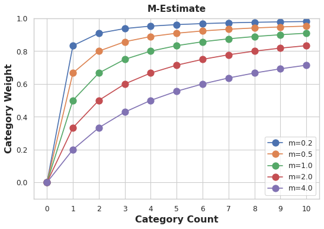
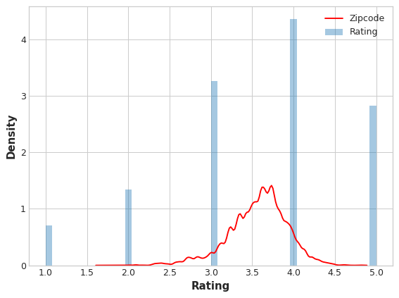

# Target Encoding

* Target encoding là bất kỳ loại mã hóa nào thay thế các danh mục của đối tượng bằng một số bắt nguồn từ mục tiêu. 

Một cách đơn giản và hiệu quả là áp dụng phép gộp nhóm từ Bài 3, giống như giá trị trung bình. Bằng cách sử dụng bộ dữ liệu Ô tô, giá trị này sẽ tính giá trung bình của mỗi hãng xe:

In [2]:
```python
autos["make_encoded"] = autos.groupby("make")["price"].transform("mean")

autos[["make", "price", "make_encoded"]].head(10)
```
Out[2]:
| make        | price | make_encoded |
|-------------|-------|--------------|
| alfa-romero | 13495 | 15498.333333 |
| alfa-romero | 16500 | 15498.333333 |
| alfa-romero | 16500 | 15498.333333 |
| audi        | 13950 | 17859.166667 |
| audi        | 17450 | 17859.166667 |
| audi        | 15250 | 17859.166667 |
| audi        | 17710 | 17859.166667 |
| audi        | 18920 | 17859.166667 |
| audi        | 23875 | 17859.166667 |
| bmw         | 16430 | 26118.750000 |

Loại mã hóa mục tiêu này đôi khi được gọi là mean encoding. Áp dụng cho bin counting, nó còn được gọi là đếm thùng. (Các tên khác bạn có thể gặp bao gồm: mã hóa khả năng, mã hóa tác động và mã hóa loại bỏ một lần.)
## Smoothing
* Tuy nhiên, việc mã hóa như thế này có một số vấn đề. Đầu tiên là những danh mục chưa biết. Mã hóa mục tiêu tạo ra nguy cơ đặc biệt về việc trang bị quá mức, nghĩa là họ cần được đào tạo về cách phân chia "mã hóa" độc lập. Khi bạn kết hợp mã hóa với các phần tách trong tương lai, Pandas sẽ điền các giá trị còn thiếu cho bất kỳ danh mục nào không có trong phần tách mã hóa. Những giá trị còn thiếu này bạn sẽ phải quy nạp bằng cách nào đó.

Thứ hai là những loại hiếm. Khi một danh mục chỉ xuất hiện một vài lần trong tập dữ liệu, mọi số liệu thống kê được tính toán trên nhóm của nó dường như không chính xác lắm. Trong tập dữ liệu Ô tô, hiện tượng thủy ngân chỉ xảy ra một lần. Giá "trung bình" mà chúng tôi tính toán chỉ là giá của một chiếc xe đó, có thể không đại diện cho bất kỳ chiếc Mercuries nào mà chúng tôi có thể thấy trong tương lai. Mã hóa mục tiêu các danh mục hiếm có thể khiến khả năng trang bị quá mức cao hơn.

Một giải pháp cho những vấn đề này là thêm tính năng  smoothing. Ý tưởng là kết hợp mức trung bình trong danh mục với mức trung bình tổng thể. Các danh mục hiếm có ít trọng số hơn trên mức trung bình của danh mục, trong khi các danh mục bị thiếu chỉ nhận được mức trung bình tổng thể.
In pseudocode:
* **encoding = weight * in_category + (1 - weight) * overall**

Trong đó weight là giá trị từ 0 đến 1 được tính từ tần suất danh mục. Một cách dễ dàng để xác định giá trị của  weight là tính toán một m-estimate:
* **weight = n / (n + m)**

Trong đó n là tổng số lần danh mục đó xuất hiện trong dữ liệu. Tham số m xác định “hệ số làm mịn”. Giá trị lớn hơn của m đặt trọng số lớn hơn vào ước tính tổng thể.
 

 

Trong the Automobiles dataset  có ba chiếc xe mang nhãn hiệu chevrolet. Nếu bạn chọn m=2,0 thì danh mục chevrolet sẽ được mã hóa bằng 60% giá Chevrolet trung bình cộng với 40% giá trung bình tổng thể.

* **chevrolet = 0.6 * 6000.00 + 0.4 * 13285.03**

Khi chọn giá trị cho m, hãy cân nhắc xem bạn mong đợi các danh mục sẽ ảnh hưởng đến mức nào. Giá của một chiếc xe có khác nhau nhiều ở mỗi hãng không? Bạn có cần nhiều dữ liệu để có được ước tính tốt không? Nếu vậy, tốt hơn nên chọn giá trị lớn hơn cho m; nếu giá trung bình cho mỗi sản phẩm tương đối ổn định thì giá trị nhỏ hơn có thể ổn.
**Use Cases for Target Encoding**
Target encoding is great for:
•	High-cardinality features(Tính năng lượng số cao): Một tính năng có số lượng lớn danh mục có thể gây rắc rối khi mã hóa: mã hóa một lần sẽ tạo ra quá nhiều tính năng và các lựa chọn thay thế, như mã hóa nhãn, có thể không phù hợp với tính năng đó. Mã hóa mục tiêu lấy số cho các danh mục bằng cách sử dụng thuộc tính quan trọng nhất của đối tượng địa lý: mối quan hệ của nó với mục tiêu.
•	Domain-motivated features Các tính năng được thúc đẩy bởi miền: Từ kinh nghiệm trước đó, bạn có thể nghi ngờ rằng một tính năng được phân loại sẽ quan trọng ngay cả khi nó đạt điểm kém theo số liệu tính năng. Mã hóa mục tiêu có thể giúp tiết lộ tính thông tin thực sự của đối tượng địa lý.
## Example - MovieLens1M
* The MovieLens1M dataset 
chứa một triệu xếp hạng phim của người dùng trang web MovieLens, với các tính năng mô tả từng người dùng và phim. Ô ẩn này thiết lập mọi thứ:


In [3]:
```python
import matplotlib.pyplot as plt
import numpy as np
import pandas as pd
import seaborn as sns
import warnings

plt.style.use("seaborn-whitegrid")
plt.rc("figure", autolayout=True)
plt.rc(
    "axes",
    labelweight="bold",
    labelsize="large",
    titleweight="bold",
    titlesize=14,
    titlepad=10,
)
warnings.filterwarnings('ignore')


df = pd.read_csv("../input/fe-course-data/movielens1m.csv")
df = df.astype(np.uint8, errors='ignore') # reduce memory footprint
print("Number of Unique Zipcodes: {}".format(df["Zipcode"].nunique()))
```
Number of Unique Zipcodes: 3439

Với hơn 3000 danh mục, tính năng Zipcode là ứng cử viên sáng giá cho việc mã hóa mục tiêu và kích thước của tập dữ liệu này (trên một triệu hàng) có nghĩa là chúng tôi có thể dự phòng một số dữ liệu để tạo mã hóa.
Chúng ta sẽ bắt đầu bằng cách tạo mức phân chia 25% để huấn luyện bộ mã hóa mục tiêu.

In [4]:
```python
X = df.copy()
y = X.pop('Rating')

X_encode = X.sample(frac=0.25)
y_encode = y[X_encode.index]
X_pretrain = X.drop(X_encode.index)
y_train = y[X_pretrain.index]
```
Gói Category_encodings trong scikit-learn-contrib triển khai bộ mã hóa m-estimate mà chúng tôi sẽ sử dụng để mã hóa tính năng Zipcode của mình.

In [5]:
```python
from category_encoders import MEstimateEncoder

# Create the encoder instance. Choose m to control noise.
encoder = MEstimateEncoder(cols=["Zipcode"], m=5.0)

# Fit the encoder on the encoding split.
encoder.fit(X_encode, y_encode)

# Encode the Zipcode column to create the final training data
X_train = encoder.transform(X_pretrain)
```
Let's compare the encoded values to the target to see how informative our encoding might be.

In [6]:
```python
plt.figure(dpi=90)
ax = sns.distplot(y, kde=False, norm_hist=True)
ax = sns.kdeplot(X_train.Zipcode, color='r', ax=ax)
ax.set_xlabel("Rating")
ax.legend(labels=['Zipcode', 'Rating']);
``` 





Việc phân phối tính năng Zipcode được mã hóa gần như tuân theo phân phối xếp hạng thực tế, nghĩa là người xem phim có đủ sự khác biệt về xếp hạng của họ từ mã zip này đến mã zip khác để mã hóa mục tiêu của chúng tôi có thể nắm bắt được thông tin hữu ích. 

Mã hóa M-Estimate là một phương pháp mã hóa biến mục tiêu dựa trên giả định về phân phối hậu nghiệm của các biến độc lập khi biết biến mục tiêu. Trong trường hợp của bạn, chúng ta đang sử dụng M-Estimate để mã hóa cột Zipcode dựa trên giá trị biến mục tiêu Rating. 
Nói chung, M-EstimateEncoder thường được sử dụng khi muốn xử lý biến mục tiêu liên tục và giảm overfitting trong các tình huống dữ liệu có ít.

so sánh phân phối của biến mục tiêu Rating và giá trị sau khi được mã hóa của cột Zipcode. Các đường mật độ xác suất được vẽ cùng nhau để so sánh phân phối của hai biến.

Dựa vào biểu đồ, bạn có thể thấy phân phối của Zipcode sau khi được mã hóa (được biểu thị bằng đường màu đỏ) tương đối giống với phân phối của biến mục tiêu Rating (đường màu xanh). Điều này có nghĩa là mã hóa M-Estimate đã giữ được một phần nào đó của thông tin từ biến mục tiêu trong quá trình mã hóa Zipcode.
